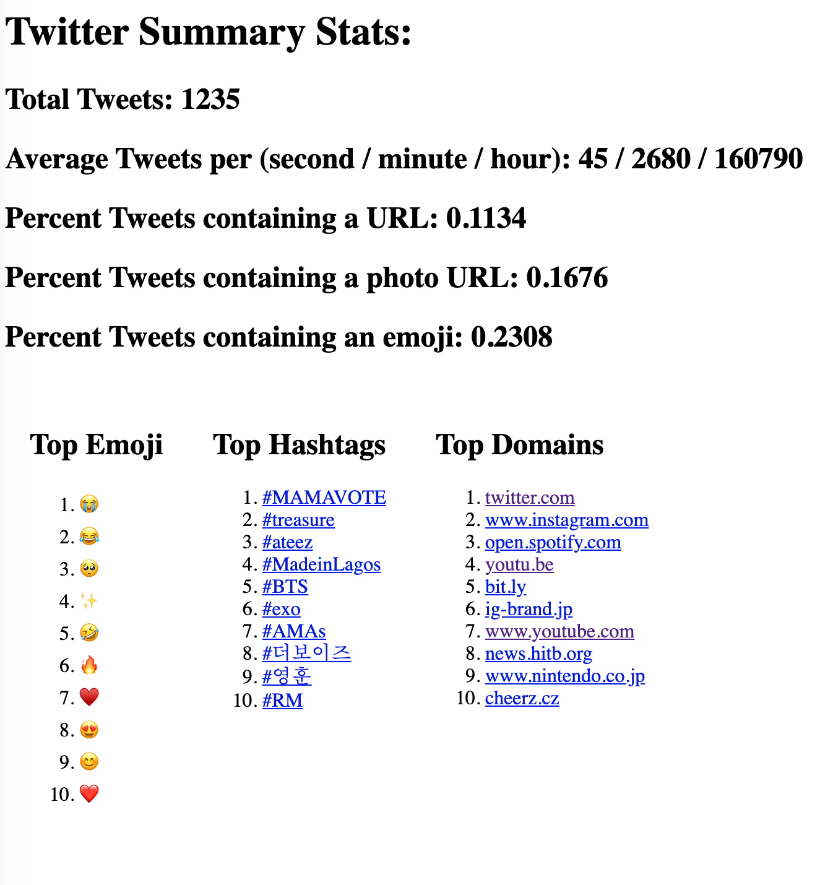

# Twitter API Exercise

A fun little experiment offloading the Twitter streaming API to a Node Worker thread. The worker is handed the incoming chunk, parses the raw data into discreet tweet events, and processes tweet events into messages with some statistics about each tweet. A simple data storage class keeps summary stats, and an express server serves the information to a simple frontend



## Configuration
At the moment you need to add your own oauth credentials to an `oauth-secrets.json` to make this work. This isn't great. Ideally we'd implement Twitters oauth flow. Anyway, `oauth-secrets.json` is obviously not checked in. It should be in the same directory as `server.js` and should look like this:

```json
{
  "token": "secret",
  "token_secret": "very secret",
  "consumer_key": "another secret",
  "consumer_secret": "too many secrets"
}
```